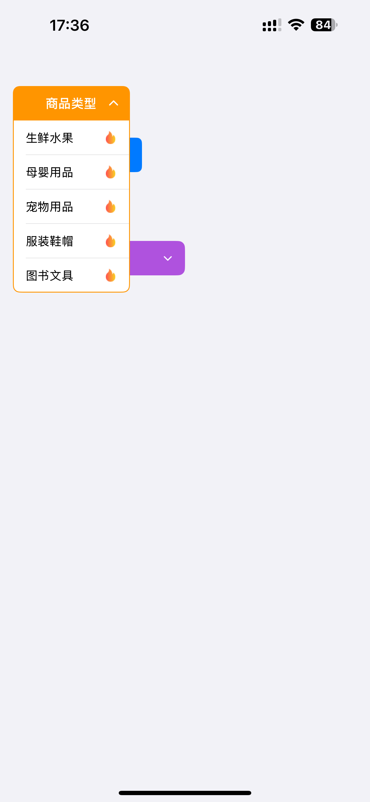
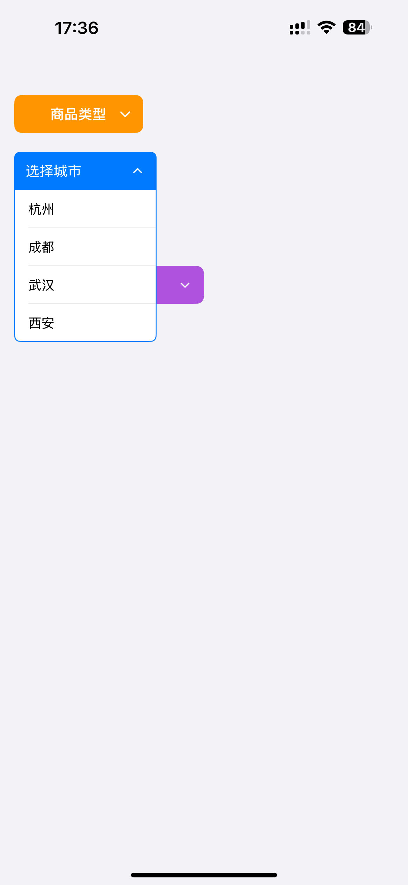
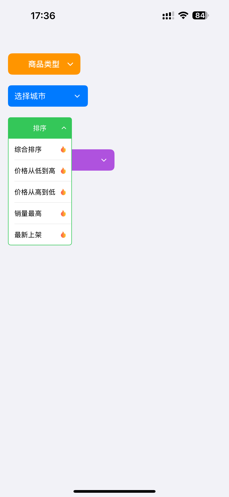
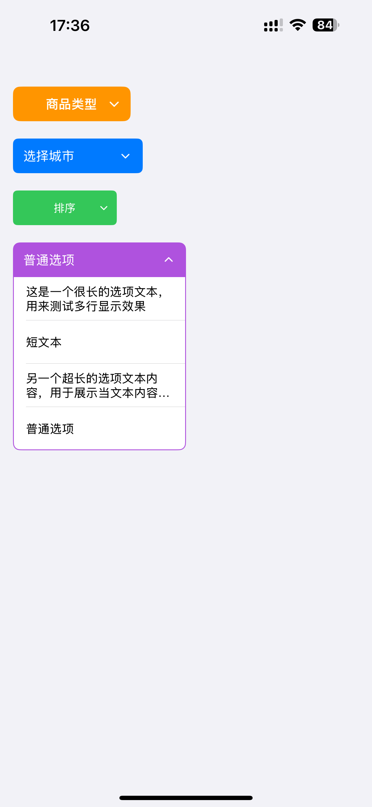

# ZHHDropdownMenu

[](https://travis-ci.org/yue5yueliang/ZHHDropdownMenu)
[](https://cocoapods.org/pods/ZHHDropdownMenu)
[](https://cocoapods.org/pods/ZHHDropdownMenu)
[](https://cocoapods.org/pods/ZHHDropdownMenu)

一个简洁易用的 iOS 下拉菜单组件，支持丰富的自定义样式、高亮效果和性能优化。

## 📋 版本说明

- **1.0.0 及以上版本**：使用 Swift 实现
- **1.0.0 以下版本**：使用 Objective-C 实现

## ✨ 主要特性

- 🎨 **丰富的自定义样式**：支持自定义标题、选项、图标、颜色、字体等
- ⚡ **性能优化**：内置缓存机制，减少重复计算，提升滚动流畅度
- ✨ **点击高亮效果**：支持自定义高亮背景颜色，提供良好的交互反馈
- 📱 **灵活配置**：支持最大高度限制、滚动、多行文本等
- 🔄 **完整的生命周期回调**：支持展开/收起前后的代理回调
- 🎯 **易于集成**：简洁的 API 设计，支持数据源和代理模式

## 📸 截图展示

<div align="center">
  
  
  
  
</div>

## 📱 系统要求

- iOS 13.0+
- Swift 5.0+
- Xcode 12.0+

## 📦 安装

### CocoaPods

在 `Podfile` 中添加：

```ruby
# Swift 版本（1.0.0+）
pod 'ZHHDropdownMenu', '~> 1.0.0'

# 或指定具体版本
pod 'ZHHDropdownMenu', '1.0.0'

# Objective-C 版本（1.0.0 以下）
pod 'ZHHDropdownMenu', '< 1.0.0'
```

然后运行：

```bash
pod install
```

## 🚀 快速开始

### 1. 导入框架

```swift
import ZHHDropdownMenu
```

### 2. 创建菜单并设置数据源和代理

```swift
let menu = ZHHDropdownMenu(frame: CGRect(x: 20, y: 100, width: 150, height: 40))
menu.dataSource = self
menu.delegate = self
view.addSubview(menu)
```

### 3. 实现数据源协议

```swift
extension ViewController: ZHHDropdownMenuDataSource {
    func numberOfOptions(in menu: ZHHDropdownMenu) -> Int {
        return options.count
    }
    
    func dropdownMenu(_ menu: ZHHDropdownMenu, optionHeightAt index: Int) -> CGFloat {
        return 40
    }
    
    func dropdownMenu(_ menu: ZHHDropdownMenu, optionTitleAt index: Int) -> String {
        return options[index]
    }
    
    func dropdownMenu(_ menu: ZHHDropdownMenu, optionIconAt index: Int) -> UIImage? {
        return UIImage(named: "icon_\(index)")
    }
}
```

### 4. 实现代理协议（可选）

```swift
extension ViewController: ZHHDropdownMenuDelegate {
    func dropdownMenu(_ menu: ZHHDropdownMenu, didSelectOptionAt index: Int, title: String) {
        print("选择了：\(title)")
    }
    
    func dropdownMenuWillAppear(_ menu: ZHHDropdownMenu) {
        print("菜单即将展开")
    }
    
    func dropdownMenuDidAppear(_ menu: ZHHDropdownMenu) {
        print("菜单已展开")
    }
    
    func dropdownMenuWillDisappear(_ menu: ZHHDropdownMenu) {
        print("菜单即将收起")
    }
    
    func dropdownMenuDidDisappear(_ menu: ZHHDropdownMenu) {
        print("菜单已收起")
    }
}
```

## 🎨 自定义样式

### 标题样式

```swift
menu.menuTitle = "请选择"
menu.menuTitleBackgroundColor = UIColor.systemBlue
menu.menuTitleFont = UIFont.boldSystemFont(ofSize: 15)
menu.menuTitleTextColor = UIColor.white
menu.menuTitleAlignment = .center
menu.menuTitleEdgeInsets = UIEdgeInsets(top: 0, left: 10, bottom: 0, right: 10)
```

### 箭头图标

```swift
menu.menuArrowIcon = UIImage(named: "arrow_down")
menu.menuArrowIconSize = CGSize(width: 15, height: 15)
menu.menuArrowIconMarginRight = 7.5
menu.menuArrowIconTintColor = UIColor.white
```

### 选项样式

```swift
menu.optionBackgroundColor = UIColor.white
menu.optionTextFont = UIFont.systemFont(ofSize: 14)
menu.optionTextColor = UIColor.label
menu.optionTextAlignment = .left
menu.optionTextMarginLeft = 15
menu.optionNumberOfLines = 0  // 0 表示不限制行数
menu.optionIconSize = CGSize(width: 20, height: 20)
menu.optionIconMarginRight = 15
```

### 分割线

```swift
menu.separatorColor = UIColor.systemGray5
menu.separatorInsets = UIEdgeInsets(top: 0, left: 15, bottom: 0, right: 0)
```

### 列表配置

```swift
menu.optionsListMaxHeight = 200  // 超过此高度则滚动，0 表示不限制
menu.showsVerticalScrollIndicator = true
menu.animationDuration = 0.25
```

### 高亮效果

```swift
menu.optionHighlightedBackgroundColor = UIColor.systemBlue.withAlphaComponent(0.2)
```

## 📖 完整示例

```swift
import UIKit
import ZHHDropdownMenu

class ViewController: UIViewController {
    
    private lazy var dropdownMenu: ZHHDropdownMenu = {
        let menu = ZHHDropdownMenu(frame: CGRect(x: 20, y: 100, width: 150, height: 40))
        menu.dataSource = self
        menu.delegate = self
        
        // 边框和圆角
        menu.layer.borderColor = UIColor.systemBlue.cgColor
        menu.layer.borderWidth = 1
        menu.layer.cornerRadius = 8
        menu.layer.masksToBounds = true
        
        // 标题样式
        menu.menuTitle = "选择城市"
        menu.menuTitleBackgroundColor = UIColor.systemBlue
        menu.menuTitleFont = UIFont.boldSystemFont(ofSize: 15)
        menu.menuTitleTextColor = UIColor.white
        menu.menuTitleAlignment = .center
        
        // 箭头图标
        menu.menuArrowIcon = UIImage(named: "arrow_down")
        menu.menuArrowIconSize = CGSize(width: 16, height: 16)
        menu.menuArrowIconTintColor = UIColor.white
        
        // 选项样式
        menu.optionBackgroundColor = UIColor.white
        menu.optionTextFont = UIFont.systemFont(ofSize: 14)
        menu.optionTextColor = UIColor.label
        menu.optionTextAlignment = .left
        menu.optionTextMarginLeft = 15
        
        // 列表配置
        menu.optionsListMaxHeight = 200
        menu.showsVerticalScrollIndicator = true
        
        return menu
    }()
    
    private let options = ["北京", "上海", "广州", "深圳", "杭州", "成都"]
    
    override func viewDidLoad() {
        super.viewDidLoad()
        view.addSubview(dropdownMenu)
    }
}

extension ViewController: ZHHDropdownMenuDataSource {
    func numberOfOptions(in menu: ZHHDropdownMenu) -> Int {
        return options.count
    }
    
    func dropdownMenu(_ menu: ZHHDropdownMenu, optionHeightAt index: Int) -> CGFloat {
        return 40
    }
    
    func dropdownMenu(_ menu: ZHHDropdownMenu, optionTitleAt index: Int) -> String {
        return options[index]
    }
    
    func dropdownMenu(_ menu: ZHHDropdownMenu, optionIconAt index: Int) -> UIImage? {
        return nil  // 不显示图标
    }
}

extension ViewController: ZHHDropdownMenuDelegate {
    func dropdownMenu(_ menu: ZHHDropdownMenu, didSelectOptionAt index: Int, title: String) {
        print("选择了：\(title)")
    }
}
```

## 📚 API 文档

### ZHHDropdownMenuDataSource

数据源协议，提供菜单选项数据。

```swift
/// 获取下拉菜单的选项数量
func numberOfOptions(in menu: ZHHDropdownMenu) -> Int

/// 获取指定索引选项的高度
func dropdownMenu(_ menu: ZHHDropdownMenu, optionHeightAt index: Int) -> CGFloat

/// 获取指定索引选项的标题
func dropdownMenu(_ menu: ZHHDropdownMenu, optionTitleAt index: Int) -> String

/// 获取指定索引选项的图标（可选）
func dropdownMenu(_ menu: ZHHDropdownMenu, optionIconAt index: Int) -> UIImage?
```

### ZHHDropdownMenuDelegate

代理协议，监听菜单事件。

```swift
/// 下拉菜单即将展开（可选）
func dropdownMenuWillAppear(_ menu: ZHHDropdownMenu)

/// 下拉菜单已经展开（可选）
func dropdownMenuDidAppear(_ menu: ZHHDropdownMenu)

/// 下拉菜单即将收起（可选）
func dropdownMenuWillDisappear(_ menu: ZHHDropdownMenu)

/// 下拉菜单已经收起（可选）
func dropdownMenuDidDisappear(_ menu: ZHHDropdownMenu)

/// 选中某个选项（可选）
func dropdownMenu(_ menu: ZHHDropdownMenu, didSelectOptionAt index: Int, title: String)
```

### 主要属性

#### 标题相关
- `menuTitle: String` - 菜单标题文本
- `menuTitleBackgroundColor: UIColor?` - 标题背景颜色
- `menuTitleFont: UIFont` - 标题字体
- `menuTitleTextColor: UIColor` - 标题文字颜色
- `menuTitleAlignment: NSTextAlignment` - 标题对齐方式
- `menuTitleEdgeInsets: UIEdgeInsets` - 标题边距

#### 箭头图标
- `menuArrowIcon: UIImage?` - 箭头图标
- `menuArrowIconSize: CGSize` - 箭头图标大小
- `menuArrowIconMarginRight: CGFloat` - 箭头距离右侧间距
- `menuArrowIconTintColor: UIColor` - 箭头图标颜色

#### 选项样式
- `optionBackgroundColor: UIColor` - 选项背景颜色
- `optionTextFont: UIFont` - 选项文字字体
- `optionTextColor: UIColor` - 选项文字颜色
- `optionTextAlignment: NSTextAlignment` - 选项文字对齐方式
- `optionTextMarginLeft: CGFloat` - 选项文字左边距
- `optionNumberOfLines: Int` - 选项文字最大行数（0 表示不限制）
- `optionIconSize: CGSize` - 选项图标大小
- `optionIconMarginRight: CGFloat` - 选项图标右边距
- `optionHighlightedBackgroundColor: UIColor?` - 选项高亮背景颜色

#### 列表配置
- `optionsListMaxHeight: CGFloat` - 列表最大高度（0 表示不限制）
- `showsVerticalScrollIndicator: Bool` - 是否显示垂直滚动条
- `animationDuration: TimeInterval` - 动画时长

#### 分割线
- `separatorColor: UIColor?` - 分割线颜色
- `separatorInsets: UIEdgeInsets` - 分割线边距

## 🎯 使用场景

- 表单选择器
- 筛选菜单
- 操作列表
- 排序选择
- 分类选择
- 地区选择

## 📝 示例项目

运行示例项目，请先克隆仓库，然后在 `Example` 目录下运行：

```bash
cd Example
pod install
```

然后打开 `ZHHDropdownMenu.xcworkspace` 运行项目。

## 🤝 贡献

欢迎提交 Issue 和 Pull Request！

## 📄 许可证

ZHHDropdownMenu 基于 MIT 许可证开源。详情请查看 [LICENSE](LICENSE) 文件。

## 👤 作者

桃色三岁 - 136769890@qq.com

GitHub: [@yue5yueliang](https://github.com/yue5yueliang)

## 🔗 相关链接

- [项目主页](https://github.com/yue5yueliang/ZHHDropdownMenu)
- [CocoaPods](https://cocoapods.org/pods/ZHHDropdownMenu)
